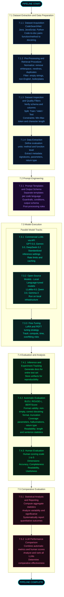

# LLM Code Documentation Generation Pipeline

```mermaid
flowchart TD

    START([PIPELINE START]) --> S71

    %% ─────────────────────────────────────────────
    %% SECTION 7.1 — DATASET EXTRACTION
    %% ─────────────────────────────────────────────
    subgraph S71 [7.1  Dataset Extraction and Data Preparation]
        direction TB

        N711["7.1.1  Dataset Acquisition
        CodeSearchNet: Java, JavaScript, Python
        Code-to-doc pairs: function/method to docstring"]

        N712["7.1.2  Pre-Processing and Retrieval Procedure
        Normalize: remove whitespace, newlines, duplicates
        Filter: empty strings, non-English, boilerplates"]

        N713["7.1.3  Dataset Inspection and Quality Filters
        Verify schema and columns
        Split: Train / Valid / Test
        Constraints: Min-Max token and character length"]

        N714["7.1.4  Data Extraction
        Define evaluation units: method and function level
        Extract metadata: signatures, parameters, return type"]

        N711 --> N712 --> N713 --> N714
    end

    %% ─────────────────────────────────────────────
    %% SECTION 7.2 — PROMPT ENGINEERING
    %% ─────────────────────────────────────────────
    subgraph S72 [7.2  Prompt Engineering]
        direction TB

        N721["7.2.1  Prompt Templates and Output Schema
        Separate templates per code language
        Guardrails, conditions, output schema
        Post-processing rules"]
    end

    %% ─────────────────────────────────────────────
    %% SECTION 7.3 — MODEL EXECUTION
    %% ─────────────────────────────────────────────
    subgraph S73 [7.3  Model Execution]
        direction TB

        subgraph S73_PARALLEL [Parallel Model Tracks]
            direction LR

            N731["7.3.1  Commercial LLMs via API
            GPT-5.0, Gemini-3.0, DeepSeek-3.2
            Standardized inference settings
            Rate limits and caching"]

            N732["7.3.2  Open-Source Models - Local
            Language-tuned models
            LLaMa-4.0, Qwen 3.0, Gemma-3
            Run on local infrastructure"]
        end

        N733["7.3.3  Fine-Tuning
        LoRA and PEFT tuning strategy
        Track: compute, time, overfitting risks"]

        S73_PARALLEL --> N733
    end

    %% ─────────────────────────────────────────────
    %% SECTION 7.4 — EVALUATION AND ANALYSIS
    %% ─────────────────────────────────────────────
    subgraph S74 [7.4  Evaluation and Analysis]
        direction TB

        N741["7.4.1  Inference and Experiment Tracking
        Generate docs for entire test set
        Store artifacts for reproducibility"]

        N742["7.4.2  Automatic Evaluation
        BLEU, ROUGE-L, BERTScore
        Format validity: non-empty, correct docstring format, truncation
        Coverage: parameters, hallucinations, return type
        Readability: length and sentence statistics"]

        N743["7.4.3  Human Evaluation
        Human scoring scale 1 to 5
        Dimensions: Accuracy, Completeness
        Readability, Usefulness"]

        N741 --> N742 --> N743
    end

    %% ─────────────────────────────────────────────
    %% SECTION 7.5 — COMPARATIVE EVALUATION
    %% ─────────────────────────────────────────────
    subgraph S75 [7.5  Comparative Evaluation]
        direction TB

        N751["7.5.1  Statistical Analysis and Reporting
        Compute aggregate statistics
        Analyze variability and significance
        Systematically report quantitative outcomes"]

        N752["7.5.2  LLM Performance Comparison
        Combine automatic metrics and human scores
        Analyze and rank all LLMs
        Determine comparative effectiveness"]

        N751 --> N752
    end

    END_NODE([PIPELINE COMPLETE])

    %% ─────────────────────────────────────────────
    %% MAIN FLOW CONNECTORS
    %% ─────────────────────────────────────────────
    S71 --> S72
    S72 --> S73
    S73 --> S74
    S74 --> S75
    S75 --> END_NODE

    %% ─────────────────────────────────────────────
    %% FUTURISTIC DARK CYBER STYLING
    %% ─────────────────────────────────────────────
    classDef termStyle   fill:#0D0D1A,color:#00F5FF,stroke:#00F5FF,stroke-width:2px
    classDef step71      fill:#0A1628,color:#60AFFF,stroke:#1E5FA8,stroke-width:1px
    classDef step72      fill:#1A0A2E,color:#B07FFF,stroke:#5A2DA8,stroke-width:1px
    classDef step73      fill:#0A2020,color:#00FFCC,stroke:#007A5A,stroke-width:1px
    classDef step74      fill:#0A1E14,color:#00FF88,stroke:#006040,stroke-width:1px
    classDef step75      fill:#1E0A14,color:#FF6EAA,stroke:#8A1040,stroke-width:1px

    class START,END_NODE termStyle
    class N711,N712,N713,N714 step71
    class N721 step72
    class N731,N732,N733 step73
    class N741,N742,N743 step74
    class N751,N752 step75
```
