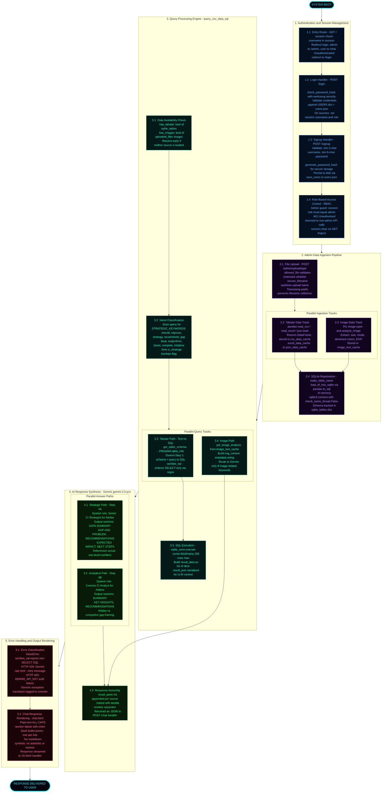

# Competitive Intelligence Chatbot — Technical System Flowchart

```mermaid
flowchart TD

    START([SYSTEM BOOT]) --> S1

    %% ══════════════════════════════════════════════════
    %% SECTION 1 — AUTHENTICATION AND SESSION MANAGEMENT
    %% ══════════════════════════════════════════════════
    subgraph S1 [1.  Authentication and Session Management]
        direction TB

        N11["1.1  Entry Route - GET /
        session check: username in session
        Redirect logic: admin to /admin, user to /chat
        Unauthenticated: redirect to /login"]

        N12["1.2  Login Handler - POST /login
        check_password_hash with werkzeug.security
        Validate credentials against USERS dict + users.json
        On success: set session username and role"]

        N13["1.3  Signup Handler - POST /signup
        Validate: min 3-char username, min 6-char password
        generate_password_hash for secure storage
        Persist to disk via save_users to users.json"]

        N14["1.4  Role-Based Access Control - RBAC
        Admin guard: session role must equal admin
        401 Unauthorized returned to non-admin API calls
        session.clear on GET /logout"]

        N11 --> N12 --> N13 --> N14
    end

    %% ══════════════════════════════════════════════════
    %% SECTION 2 — ADMIN DATA INGESTION PIPELINE
    %% ══════════════════════════════════════════════════
    subgraph S2 [2.  Admin Data Ingestion Pipeline]
        direction TB

        N21["2.1  File Upload - POST /admin/upload/type
        allowed_file validates extension whitelist
        secure_filename sanitizes upload name
        Timestamp prefix prevents filename collisions"]

        subgraph S2_PARALLEL [Parallel Ingestion Tracks]
            direction LR

            N22["2.2  Tabular Data Track
            pandas read_csv / read_excel / json.load
            Returns DataFrame stored in csv_data_cache
            excel_data_cache or json_data_cache"]

            N23["2.3  Image Data Track
            PIL Image.open and analyze_image
            Extract: size, mode, dominant colors, EXIF
            Stored in image_text_cache"]
        end

        N24["2.4  SQLite Registration - make_table_name
        load_df_into_sqlite via pandas to_sql
        In-memory sqlite3.connect with check_same_thread False
        Schema tracked in sqlite_tables dict"]

        N21 --> S2_PARALLEL
        N22 --> N24
        N23 --> N24
    end

    %% ══════════════════════════════════════════════════
    %% SECTION 3 — QUERY PROCESSING ENGINE
    %% ══════════════════════════════════════════════════
    subgraph S3 [3.  Query Processing Engine - query_csv_data_sql]
        direction TB

        N31["3.1  Data Availability Check
        has_tabular: bool of sqlite_tables
        has_images: bool of uploaded_files images
        Returns early if neither source is loaded"]

        N32["3.2  Intent Classification
        Scan query for STRATEGIC_KEYWORDS:
        should, improve, strategy, recommend, gap
        beat, outperform, boost, compete, initiative
        Sets is_strategic boolean flag"]

        subgraph S3_PARALLEL [Parallel Query Tracks]
            direction LR

            N33["3.3  Tabular Path - Text-to-SQL
            get_sqlite_schema - PRAGMA table_info
            Gemini Step 1: schema + query to SQL
            sanitize_sql - enforce SELECT-only via regex"]

            N34["3.4  Image Path
            get_image_analysis from image_text_cache
            Build img_context metadata string
            Route to Gemini only if image-related keywords"]
        end

        N35["3.5  SQL Execution - sqlite_conn.execute
        cursor.fetchmany 200 rows max
        Build result_data as list of dicts
        result_json serialized for LLM context"]

        N31 --> N32 --> S3_PARALLEL
        N33 --> N35
    end

    %% ══════════════════════════════════════════════════
    %% SECTION 4 — AI RESPONSE SYNTHESIS
    %% ══════════════════════════════════════════════════
    subgraph S4 [4.  AI Response Synthesis - Gemini gemini-2.5-pro]
        direction TB

        subgraph S4_PARALLEL [Parallel Answer Paths]
            direction LR

            N41["4.1  Strategic Path - Step 3A
            System role: Senior CI Strategist for Adidas
            Output sections: DATA SUMMARY
            GAP AND PROBLEM, RECOMMENDATIONS
            EXPECTED IMPACT, NEXT STEPS
            References actual row-level numbers"]

            N42["4.2  Analytical Path - Step 3B
            System role: Concise CI Analyst for Adidas
            Output sections: SUMMARY
            KEY INSIGHTS, RECOMMENDATIONS
            Adidas vs competitor gap framing"]
        end

        N43["4.3  Response Assembly
        result_parts list appended per source
        Joined with double newline separator
        Returned as JSON to POST /chat handler"]

        S4_PARALLEL --> N43
    end

    %% ══════════════════════════════════════════════════
    %% SECTION 5 — ERROR HANDLING AND RENDERING
    %% ══════════════════════════════════════════════════
    subgraph S5 [5.  Error Handling and Output Rendering]
        direction TB

        N51["5.1  Error Classification
        ValueError: sanitize_sql rejects non-SELECT SQL
        HTTP 429: Gemini rate limit - retry message
        HTTP 403: GEMINI_API_KEY auth failure
        Generic exception: traceback logged to console"]

        N52["5.2  Chat Response Rendering - chat.html
        Plain-text ALL CAPS section labels with colon
        Dash bullet points - one per line
        No markdown symbols: no asterisks or hashes
        Response streamed to JS fetch handler"]

        N51 --> N52
    end

    END_NODE([RESPONSE DELIVERED TO USER])

    S1 --> S2
    S2 --> S3
    S3 --> S4
    S4 --> S5
    N34 --> N43
    S5 --> END_NODE

    %% ══════════════════════════════════════════════════
    %% FUTURISTIC DARK CYBER COLOUR SYSTEM
    %% ══════════════════════════════════════════════════
    classDef termStyle fill:#050510,color:#00F5FF,stroke:#00F5FF,stroke-width:3px
    classDef sec1      fill:#04101F,color:#5AB4FF,stroke:#1A5FA8,stroke-width:1px
    classDef sec2      fill:#10041F,color:#C084FF,stroke:#6A2DA8,stroke-width:1px
    classDef sec3      fill:#041A18,color:#00FFD0,stroke:#008A6A,stroke-width:1px
    classDef sec4      fill:#081A08,color:#00FF88,stroke:#008040,stroke-width:1px
    classDef sec5      fill:#1A0408,color:#FF6EA8,stroke:#901040,stroke-width:1px

    class START,END_NODE termStyle
    class N11,N12,N13,N14 sec1
    class N21,N22,N23,N24 sec2
    class N31,N32,N33,N34,N35 sec3
    class N41,N42,N43 sec4
    class N51,N52 sec5
```
