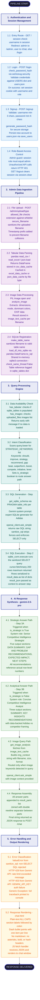

# Competitive Intelligence Chatbot — System Flowchart

```mermaid
flowchart TD

    START([PIPELINE START])

    %% ── SECTION 1: AUTH ─────────────────────────────
    S1_HDR["1.  Authentication and Session Management"]

    N11["1.1  Entry Route - GET /
    session check: username in session
    Redirect: admin to /admin, user to /chat, else /login"]

    N12["1.2  Login - POST /login
    check_password_hash via werkzeug.security
    Validate credentials against USERS dict and users.json
    On success: set session cookie with username and role"]

    N13["1.3  Signup - POST /signup
    Validate: username min 3 chars, password min 6 chars
    generate_password_hash for secure storage
    Persist new account to users.json via save_users"]

    N14["1.4  Role-Based Access Control
    Admin guard: session role must equal admin
    Unauthorized API calls return HTTP 401
    GET /logout clears session via session.clear"]

    %% ── SECTION 2: DATA INGESTION ───────────────────
    S2_HDR["2.  Admin Data Ingestion Pipeline"]

    N21["2.1  File Upload - POST /admin/upload/type
    allowed_file checks extension against whitelist
    secure_filename sanitizes the uploaded filename
    Timestamp prefix added to prevent filename collisions"]

    N22["2.2  Tabular Data Parsing
    pandas read_csv / read_excel / json.load
    Returns DataFrame stored in csv_data_cache
    Cached in excel_data_cache or json_data_cache by file type"]

    N23["2.3  Image Data Processing
    PIL Image.open and analyze_image
    Extracts: dimensions, mode, dominant colors, EXIF data
    Result stored in image_text_cache per filename"]

    N24["2.4  SQLite Registration
    make_table_name sanitizes filename to valid table name
    load_df_into_sqlite via pandas DataFrame.to_sql
    Shared in-memory sqlite3 connection - check_same_thread False
    Table reference logged in sqlite_tables dict"]

    %% ── SECTION 3: QUERY PROCESSING ────────────────
    S3_HDR["3.  Query Processing Engine"]

    N31["3.1  Data Availability Check
    has_tabular: checks if sqlite_tables is populated
    has_images: checks uploaded_files images list
    Returns early with message if no data is loaded"]

    N32["3.2  Intent Classification
    Scans query.lower for STRATEGIC_KEYWORDS list
    Keywords: should, improve, strategy, recommend, gap
    beat, outperform, boost, compete, initiative, lever
    Sets is_strategic boolean to route answer path"]

    N33["3.3  SQL Generation - Step 1
    get_sqlite_schema via PRAGMA table_info per table
    Gemini system prompt: expert SQLite generator for Adidas
    openai_client.ask_simple returns raw SQL string
    sanitize_sql strips fences and enforces SELECT-only"]

    N34["3.4  SQL Execution - Step 2
    sqlite_conn.execute runs the sanitized SELECT query
    cursor.fetchmany 200 rows maximum returned
    Rows serialized to result_data as list of dicts
    result_json passed as context to answer step"]

    %% ── SECTION 4: AI SYNTHESIS ─────────────────────
    S4_HDR["4.  AI Response Synthesis - gemini-2.5-pro"]

    N41["4.1  Strategic Answer Path - Step 3A
    Triggered when is_strategic is True
    System role: Senior Competitive Intelligence Strategist
    Five output sections: DATA SUMMARY, GAP AND PROBLEM
    RECOMMENDATIONS, EXPECTED IMPACT, NEXT STEPS
    All recommendations reference actual row-level numbers"]

    N42["4.2  Analytical Answer Path - Step 3B
    Triggered when is_strategic is False
    System role: Concise Competitive Intelligence Analyst
    Three output sections: SUMMARY, KEY INSIGHTS
    RECOMMENDATIONS with data-backed Adidas vs competitor framing"]

    N43["4.3  Image Query Path
    get_image_analysis fetches from image_text_cache
    Builds img_context string with filename, size, format
    Routed only when image keywords detected in query
    openai_client.ask_simple with image context provided"]

    N44["4.4  Response Assembly
    All answer parts appended to result_parts list
    Joined with double newline separator between parts
    Final string returned as JSON response to POST /chat"]

    %% ── SECTION 5: ERROR HANDLING AND OUTPUT ────────
    S5_HDR["5.  Error Handling and Output Rendering"]

    N51["5.1  Error Classification
    ValueError from sanitize_sql: non-SELECT SQL rejected
    HTTP 429 from Gemini API: rate limit exceeded message
    HTTP 403 from Gemini API: GEMINI_API_KEY auth failure
    Generic Exception: full traceback printed to console"]

    N52["5.2  Response Rendering - chat.html
    Plain-text ALL CAPS section labels followed by colon
    Dash bullet points with one item per line
    No markdown: no asterisks, bold, or hash headers
    JS fetch handler receives JSON and renders to chat window"]

    END_NODE([RESPONSE DELIVERED])

    %% ── CONNECTIONS ─────────────────────────────────
    START --> S1_HDR
    S1_HDR --> N11 --> N12 --> N13 --> N14

    N14 --> S2_HDR
    S2_HDR --> N21 --> N22 --> N23 --> N24

    N24 --> S3_HDR
    S3_HDR --> N31 --> N32 --> N33 --> N34

    N34 --> S4_HDR
    S4_HDR --> N41 --> N42 --> N43 --> N44

    N44 --> S5_HDR
    S5_HDR --> N51 --> N52 --> END_NODE

    %% ── CLEAN PRINT-FRIENDLY STYLING ────────────────
    classDef termStyle fill:#1A1A2E,color:#E0E0FF,stroke:#4A4AFF,stroke-width:2px
    classDef hdrStyle  fill:#E8EAF6,color:#1A237E,stroke:#3949AB,stroke-width:2px,font-weight:bold
    classDef sec1Style fill:#E3F2FD,color:#0D47A1,stroke:#1976D2,stroke-width:1px
    classDef sec2Style fill:#F3E5F5,color:#4A148C,stroke:#7B1FA2,stroke-width:1px
    classDef sec3Style fill:#E0F2F1,color:#004D40,stroke:#00796B,stroke-width:1px
    classDef sec4Style fill:#E8F5E9,color:#1B5E20,stroke:#388E3C,stroke-width:1px
    classDef sec5Style fill:#FFF8E1,color:#E65100,stroke:#F57C00,stroke-width:1px

    class START,END_NODE termStyle
    class S1_HDR,S2_HDR,S3_HDR,S4_HDR,S5_HDR hdrStyle
    class N11,N12,N13,N14 sec1Style
    class N21,N22,N23,N24 sec2Style
    class N31,N32,N33,N34 sec3Style
    class N41,N42,N43,N44 sec4Style
    class N51,N52 sec5Style
```
