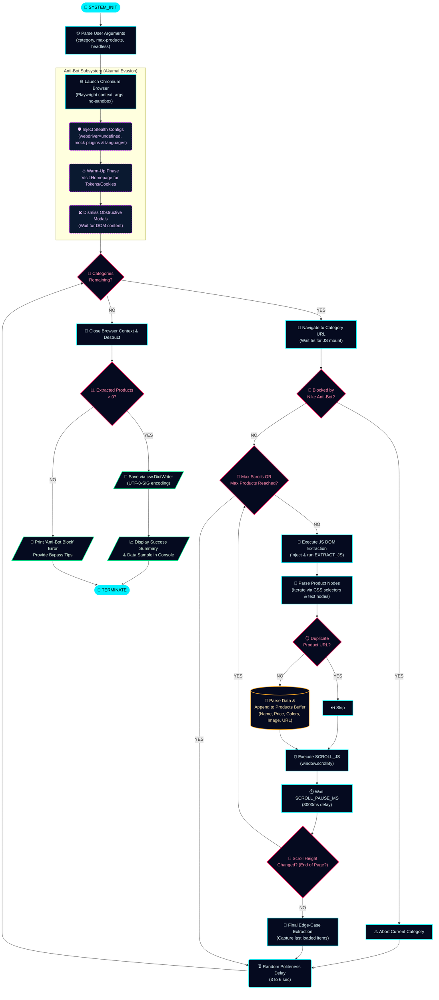

# Nike Scraper Architecture Flowchart

Below is the highly-detailed, futuristic architecture flowchart for the `nike_scraper.py` script.

```mermaid
%%{init: {
  'theme': 'base',
  'themeVariables': {
    'primaryColor': '#050a1f',
    'primaryTextColor': '#00f0ff',
    'primaryBorderColor': '#00f0ff',
    'lineColor': '#ff0055',
    'secondaryColor': '#0a1930',
    'tertiaryColor': '#050a1f',
    'mainBkg': '#02040a',
    'nodeBorder': '#00f0ff',
    'clusterBkg': '#03081c',
    'clusterBorder': '#ff0055',
    'defaultLinkColor': '#ff0055',
    'fontFamily': 'Orbitron, "Courier New", monospace'
  }
}}%%
flowchart TD
    classDef startEnd fill:#00f0ff,stroke:#ffffff,stroke-width:2px,color:#000000,rx:15,ry:15
    classDef process fill:#050a1f,stroke:#00f0ff,stroke-width:2px,color:#e0f7fa
    classDef decision fill:#050a1f,stroke:#ff0055,stroke-width:2px,color:#ff88ab
    classDef io fill:#050a1f,stroke:#00ff99,stroke-width:2px,color:#e0ffe8
    classDef db fill:#050a1f,stroke:#f5a623,stroke-width:2px,color:#ffebb3
    classDef stealth fill:#0a1930,stroke:#ba00ff,stroke-width:2px,color:#eec4ff,stroke-dasharray: 4 4

    A(["🚀 SYSTEM_INIT"]):::startEnd --> B["⚙️ Parse User Arguments<br/>(category, max-products, headless)"]:::process
    B --> C["🌐 Launch Chromium Browser<br/>(Playwright context, args: no-sandbox)"]:::process

    subgraph Cyber_Stealth ["Anti-Bot Subsystem (Akamai Evasion)"]
        C --> D("🛡️ Inject Stealth Configs<br/>(webdriver=undefined, mock plugins & languages)"):::stealth
        D --> E("🔥 Warm-Up Phase<br/>Visit Homepage for Tokens/Cookies"):::stealth
        E --> F("✖️ Dismiss Obstructive Modals<br/>(Wait for DOM content)"):::stealth
    end

    F --> G{"📂 Categories<br/>Remaining?"}:::decision

    G -- "YES" --> H["🔗 Navigate to Category URL<br/>(Wait 5s for JS mount)"]:::process
    H --> I{"🤖 Blocked by<br/>Nike Anti-Bot?"}:::decision

    I -- "YES" --> J["⚠️ Abort Current Category"]:::process
    J --> K("⏳ Random Politeness Delay<br/>(3 to 6 sec)"):::process
    K --> G

    I -- "NO" --> L{"📜 Max Scrolls OR<br/>Max Products Reached?"}:::decision

    L -- "NO" --> M["💉 Execute JS DOM Extraction<br/>(Inject & run EXTRACT_JS)"]:::process
    M --> N["🧩 Parse Product Nodes<br/>(Iterate via CSS selectors & text nodes)"]:::process

    N --> O{"🪞 Duplicate<br/>Product URL?"}:::decision
    O -- "YES" --> P["⏭️ Skip"]:::process
    O -- "NO" --> Q[("💾 Parse Data &<br/>Append to Products Buffer<br/>(Name, Price, Colors, Image, URL)")]:::db
    
    P --> R
    Q --> R

    R["🖱️ Execute SCROLL_JS<br/>(window.scrollBy)"]:::process --> S["⏱️ Wait SCROLL_PAUSE_MS<br/>(3000ms delay)"]:::process
    S --> T{"📏 Scroll Height<br/>Changed? (End of Page?)"}:::decision

    T -- "YES" --> L
    T -- "NO" --> U["🏁 Final Edge-Case Extraction<br/>(Capture last loaded items)"]:::process
    U --> K

    L -- "YES" --> K

    G -- "NO" --> V["🚪 Close Browser Context & Destruct"]:::process
    V --> W{"📊 Extracted Products<br/>> 0?"}:::decision

    W -- "YES" --> X[/"📝 Save via csv.DictWriter<br/>(UTF-8-SIG encoding)"/]:::io
    X --> Y[/"📈 Display Success Summary<br/>& Data Sample in Console"/]:::io
    
    W -- "NO" --> Z[/"🚨 Print 'Anti-Bot Block' Error<br/>Provide Bypass Tips"/]:::io

    Y --> End(["🛑 TERMINATE"]):::startEnd
    Z --> End
```
